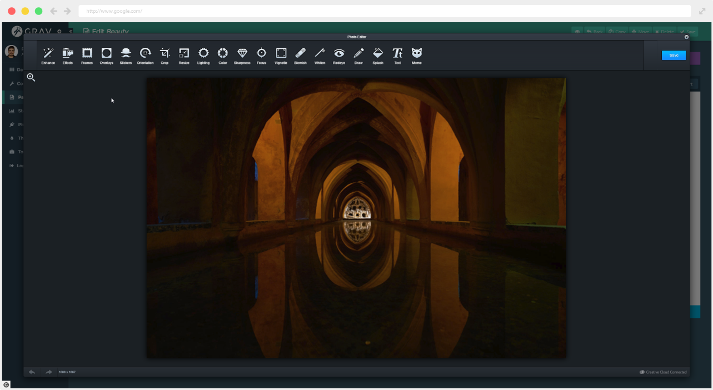

# Aviary Image Editor



The **Aviary** Plugin is for [Grav CMS](http://github.com/getgrav/grav). Aviary image editor integration with the Grav CMS

## Installation

Installing the Aviary plugin can be done in one of two ways. The GPM (Grav Package Manager) installation method enables you to quickly and easily install the plugin with a simple terminal command, while the manual method enables you to do so via a zip file.

### GPM Installation (Preferred)

The simplest way to install this plugin is via the [Grav Package Manager (GPM)](http://learn.getgrav.org/advanced/grav-gpm) through your system's terminal (also called the command line).  From the root of your Grav install type:

    bin/gpm install aviary

This will install the Aviary plugin into your `/user/plugins` directory within Grav. Its files can be found under `/your/site/grav/user/plugins/aviary`.

### Manual Installation

To install this plugin, just download the zip version of this repository and unzip it under `/your/site/grav/user/plugins`. Then, rename the folder to `aviary`. You can find these files on [GitHub](https://github.com/ricardo118/grav-plugin-aviary) or via [GetGrav.org](http://getgrav.org/downloads/plugins#extras).

You should now have all the plugin files under

    /your/site/grav/user/plugins/aviary
	
> NOTE: This plugin is a modular component for Grav Admin which requires [Grav](http://github.com/getgrav/grav), and the [Admin](https://github.com/getgrav/grav-admin-plugin)  the [Error](https://github.com/getgrav/grav-plugin-error) and [Problems](https://github.com/getgrav/grav-plugin-problems) to operate.

## Configuration

Before configuring this plugin, you should copy the `user/plugins/aviary/aviary.yaml` to `user/config/plugins/aviary.yaml` and only edit that copy.

Here is the default configuration and an explanation of available options:

```yaml
enabled: true
language: en
display_img_size: false
enable_cors: false
all_tools: all
theme_select: dark
```
### language
Multi Languages supported. See Plugin Config for all available languages

### display_img_size
Allows to show image size at the bottom of the editor

### enable_cors
This will speed up your editor a lot but it **requires** work done by you on your server to support.
Enabling CORS lets the Editor load your images instantaneously. Otherwise we have to work some magic to get the image. We highly encourage you to enable this for a better user experience.
**NOTE: You must setup & add the appropriate CORS headers on the server endpoint that hosts your images. Please see: [www.enable-cors.org](http://www.enable-cors.org) for more information and how to set it up on your server.**

### all_tools
This option lets you select all tools available or a custom preset, as well as a custom one done by you.

### theme_select
Choose between, Dark, Light, Minimum or Custom.

## Features

Offer a powerful, full-featured image editing UI component that allows your users to edit their photos right within your app with tons of great content and tools such as: 

- Stunning effects and frames. 
- Original high-quality stickers. 
- Beautiful overlays. 
- Fun features like tilt shift and color splash. 
- Pro-level adjustments and more. 

Customize the editor with the perfect combination of tools to create an experience your users will love.

There are many tools available for use:


 
## Usage

To use the plugin, install and set up the options as needed. All the options contain explanations on Hover or below the option. Once the editor is configured to your liking, you can use it by going to `pages` in the Admin plugin. While editing a page, you will be able to upload a picture and a little edit icon will appear next to your images. You can then proceed to edit and save the picture. The plugin will do the rest.

## Credits

**Shoutout to [Olevik](https://olevik.me/)** for the huge help in the making of this plugin. Check out his many Grav plugins [here](https://github.com/OleVik)

## Requests

If you would like to request features or have issues, please contact via github issues here or send me an email.

## Todo

- [ ] Update plugin to have production and development mode
- [ ] Allow users to edit Images while in User Site not just in Admin
- [ ] Allow user to decide whether to overwrite the image or create a new image on the same location.
- [ ] Allow for custom API Keys.
- [ ] Create new Theme Presets
- [ ] Create new Tools Presets.
